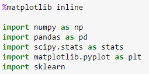
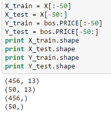
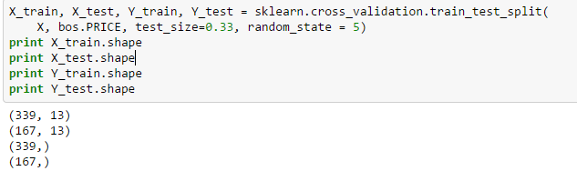

# How to run Linear regression in Python scikit-Learn:

# Linear regression:

is one of the fundamental statistical and machine learning techniques. Whether you want to do statistics, machine learning, or scientific computing

Scikit-learn :is a powerful Python module for machine learning. It contains function for regression, classification, clustering, model selection and dimensionality reduction

you can do linear regression using numpy, scipy, stats model and sckit learn

scikit learn: a way to perform linear regression

Boston Housing data set, the data set contains information about the housing values in suburbs of Boston. This dataset was originally taken from the StatLib library which is maintained at Carnegie Mellon University and is now available on the UCI Machine Learning Repository. 

# Exploring Boston Housing Data Set

The first step is to import the required Python libraries into Ipython Notebook.

Important functions to keep in mind while fitting a linear regression model are:

lm.fit() -> fits a linear model

lm.predict() -> Predict Y using the linear model with estimated coefficients

lm.score() -> Returns the coefficient of determination (R^2). A measure of how well observed outcomes are replicated by the model, as the proportion of total variation of outcomes explained by the model.

You can also explore the functions inside lm object by pressing lm.<tab>

Fitting a Linear Model

Two other parameters that you can pass to linear regression object are fit_intercept and normalize.

Training and validation data sets

In practice you wont implement linear regression on the entire data set, you will have to split the data sets into training and test data sets. So that you train your model on training data and see how well it performed on test data.

# How not to do train-test split:

# How to do train-test split:

You have to divide your data sets randomly. Scikit learn provides a function called train_test_split to do this.

# Residual Plots

Residual plots are a good way to visualize the errors in your data. If you have done a good job then your data should be randomly scattered around line zero. If you see structure in your data, that means your model is not capturing some thing. Maye be there is a interaction between 2 variables that you are not considering, or may be you are measuring time dependent data. If you get some structure in your data, you should go back to your model and check whether you are doing a good job with your parameters